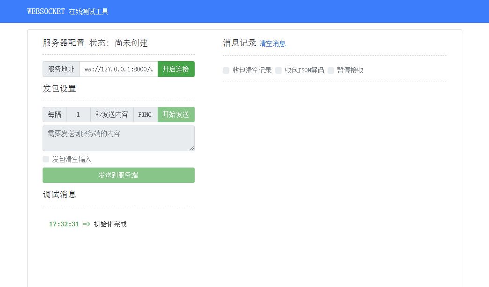
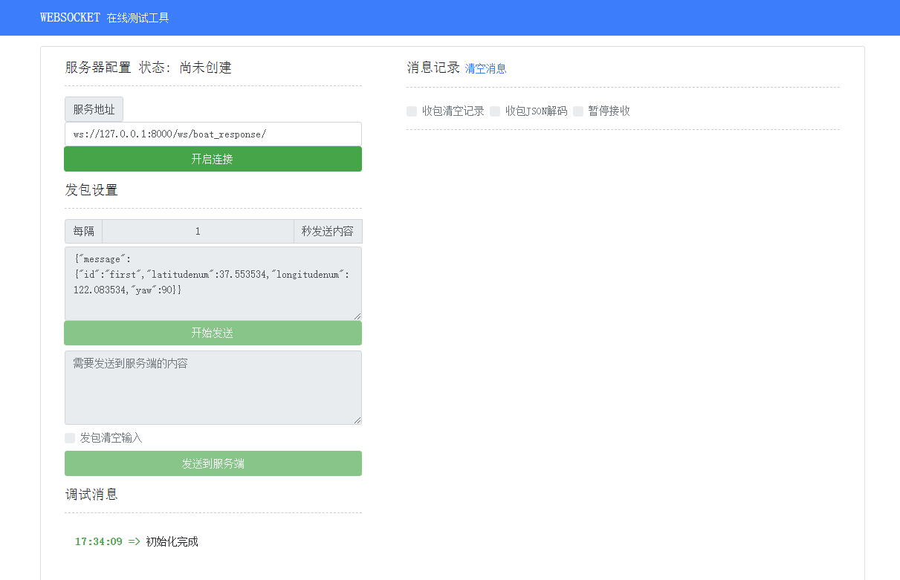

# websocket-test-client
websocket测试工具，由HTML编写。

原仓库地址：https://github.com/easy-swoole/wstool

### 主要修改内容：

+ 调整消息发送框高度。使长内容可以显示
+ 调整自动发送的消息框样式。使长内容可以显示

### 如何使用：

下载后打开 wstool.html 即可使用

### 效果对比：

+ 原页面：

  

+ 新页面：

  